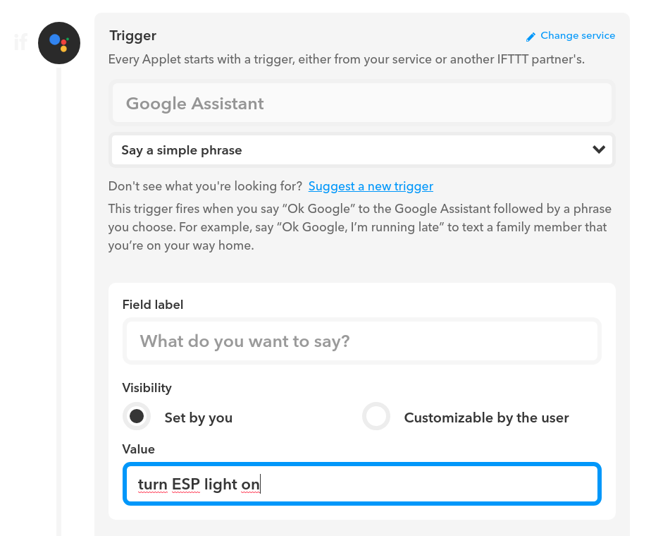
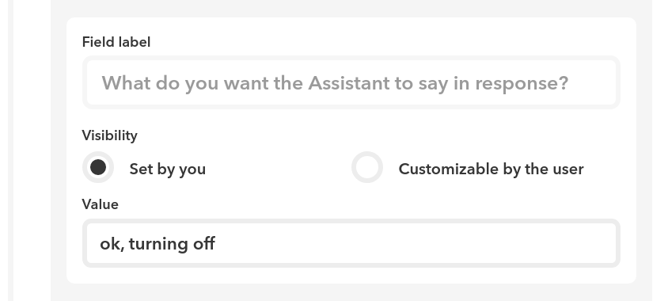
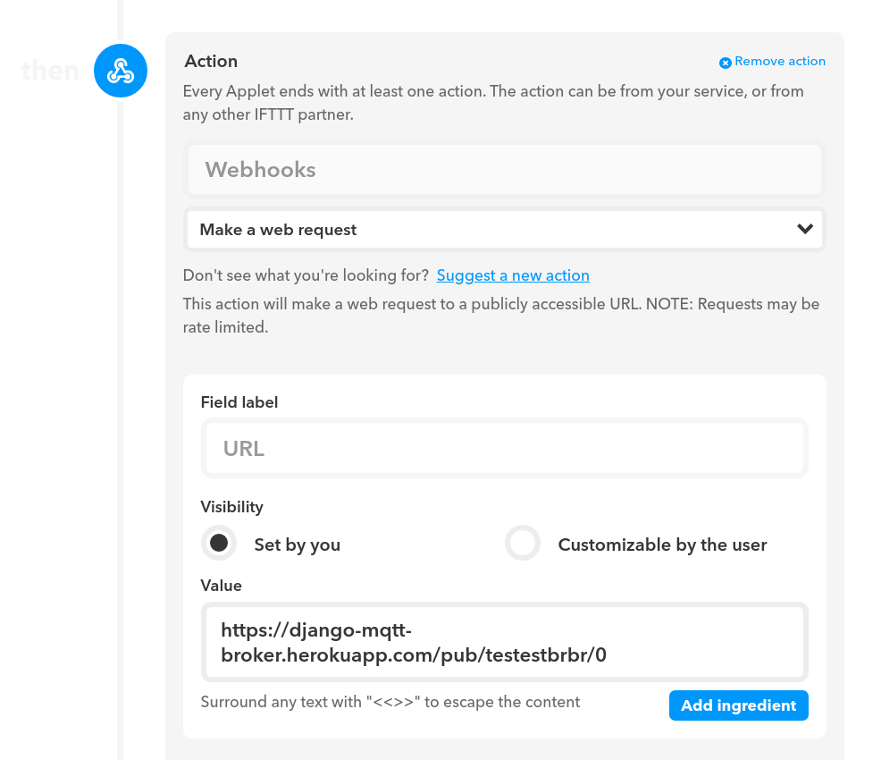
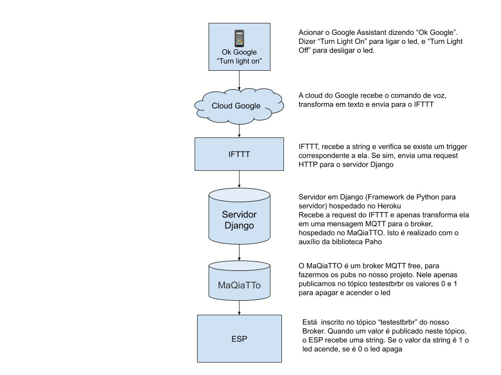

# Controlando o ESP/IoT através de comandos de voz

O objetivo deste projeto é controlar um módulo ESP (ou similares) através de comandos de voz.

Como protótipo do nosso conceito, focaremos na task simples de acender e apagar um led acoplado ao módulo.

Nas sessões que seguem descrevemos a nossa arquitetura para este protótipo.

Na última sessão resumimos a arquitetura através de um diagrama de sistema.

## Natural Language Processing

Natural Language Processing (NLP) é o campo da computação que estuda o reconhecimento e processamento de linguagem natural.
Em outras palavras, dado um comando por voz, um algoritmo de NLP deve ser capaz de interpretar a inteção do usuário e realizar a ação correspondente.

Para o escopo do nosso projeto infelizmente não temos tempo o suficiente para estudar técnicas avançadas nem tempo o suficiente para implementar o nosso próprio serviço de NLP, dado a complexidade que esse tipo de infraestrutura exige.

Por esta razão **optamos por utilizar o serviço de NLP integrado à Google Assistente**

## Google Assistente

A Google Assistente é um serviço que, como o nome sugere, tem como objetivo oferecer funcionalidades que auxiliem o usuário em tarefas rotineiras.
Dentre estas tarefas está **o controle de dispositivos IoT**.

Com comandos como _"acender luz da sala"_ o usuário é capaz de controlar a iluminação de ambientes ou desligar e ligar a TV sem a necessidade de interação física com interruptores.

Felizmente este serviço **permite a integração com serviços de terceiros** sendo assim ideal para o nosso protótipo.

A questão então é **como fazer uso do sistema de NLP da Google Assistente para controlar o módulo ESP?**

Para isso faremos uso da plataforma IFTTT.

## Criando ações para a Google Assistente

### Breve introdução sobre o IFTTT

A plataforma IFTTT (if this than that) nos permite criar ações em respostas à triggers de diversos serviços através dos chamados **applets**.

Um applet é formado por um trigger e uma ação correspondente.

No nosso caso, o trigger será **Google Assistente ouvir a frase _turn light on_**, como podemos ver na imagem que segue:

Explicando a imagem acima:
 - O serviço que dispara a ação (trigger) é o Google Assistente
 - A ação do Google Assistente que dispara o trigger é ouvir a frase _"turn ESP light on"_

disparado o trigger, precisamos que o IFTTT responda ao usuário para informa-lo de que entendeu a ação, como podemos ver na imagem que segue:

O assistente efetivamente responderá (usando síntese de voz) ao comando de voz com a frase aqui específicada.

Finalimente, queremos que o IFTTT execute uma ação em reação ao trigger, o que é configurado como na imagem abaixo:

A ação vista na imagem anterior diz ao IFTTT para **enviar um request HTTP para um servidor web (no nosso caso, na URL https://django-mqtt-broker.herokuapp.com/pub/testestbrbr/1)**.
O signficado desta URL é explicado nas próximas sessões.

## Comunicação com o ESP

**Mas como faremos para que o ESP receba um comando HTTP sem que haja como um servidor web com hostname próprio?**

A resposta é simples: não enviamos a request HTTP diretamente ao ESP. Nós enviaremos a request HTTP a um servidor web (correspondente a URL apresentada na sessão anterior) que **transformara a request em uma mensagem MQTT** e a publicará num tópico em que o ESP estará subscrito. Dessa forma descartamos a necessidade de que a Google Assistente e o ESP saibam da existência um do outro.

### Transformando uma request HTTP em uma mensagem MQTT através de um app Django

Para que a request seja transformada numa mensagem MQTT precisamos de um servidor web capaz de realizar tal operação.

Para isso utilizamos o framework web **Django**, que permite o desenvolvimento rápido de aplicações web em Python.
Não nos aprofundaremos no funcionamento do framework.
O código do servidor web está na pasta **django-mqtt-broker** e está pronto para ser hospedado gratuitamente na plataforma Heroku.

Basicamente, quando uma requisição é enviada ao servidor na URL _/pub/str/int_, o usuário está dizendo que quer que o valot _int_ seja publicado no tópico _str_.

O trecho do código que executa esta sequência de comandos está em _django-mqtt-broker/python-bridge/views.py_ e pode ser visto abaixo

`

def pub(request, topic, payload):
    client = mqtt.Client()

    client.username_pw_set("samuel.chenatti@gmail.com", "password")
    client.connect("maqiatto.com", 1883, 60)

    status = client.publish("samuel.chenatti@gmail.com/"+topic, payload=payload)

    return HttpResponse("Publish in topic {} payload {}".format("samuel.chenatti@gmail.com/"+topic, payload))

`

É importante notar que estamos usando o **Maqiatto**, um broker MQTT público e gratuito.

## O ESP

E, finalmente, o ESP executa o código presente em _mqtt_led/mqtt_led.ino_ que, resumidamente se inscreve no tópico _testestbrbr_ e aguarda por uma mensagem 1 ou 0 para acender ou apagar o LED.

## Diagrama do sistema

